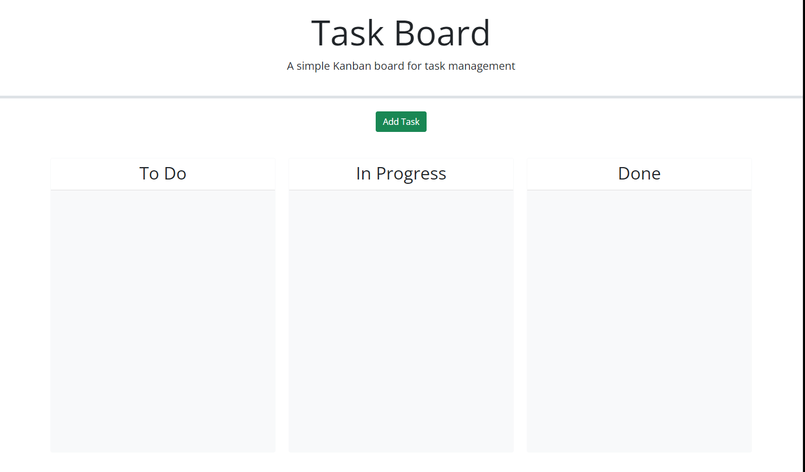
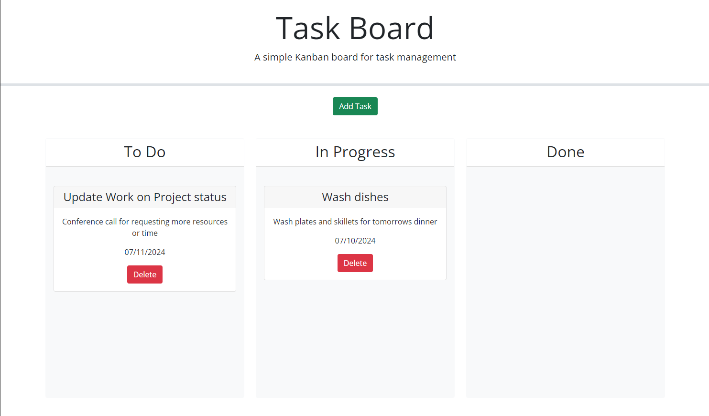

# todo-planner

## Description
A program designed to take input from user and display it on a board for a visual representation of any tasks a user may want to plan out.  Program features a due date/deadline a title and the ability to write out a discription of the task to be completed.  The program also features draggable task cards so that one may organize them based on the status of said class.  Once one is done with the task each card also features a delete but that will allow you to remove the task from the board.

## Installation
N/A

## Usage
  a program designed to organize tasks for the user.
## Screen Shot

## Credits

README. Template Provided by codeing boot camp Full- Stack Blog. url: https://coding-boot-camp.github.io/full-stack/github/professional-readme-guide

source code provided by SMU/EDX Insturctional 
collaberated with Instructional staff for debugging.

## License

N/A

